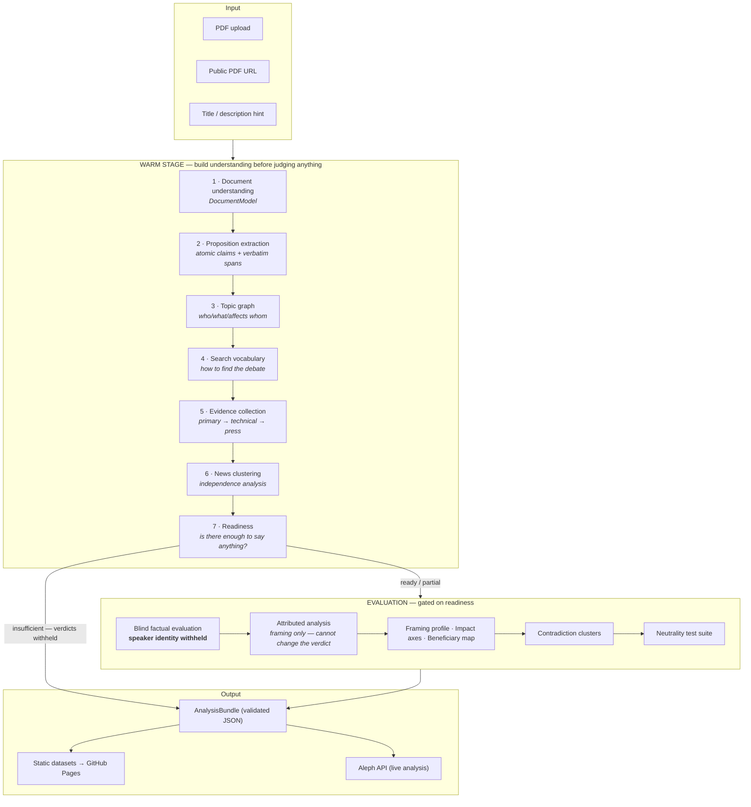
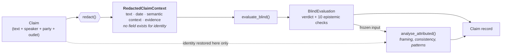
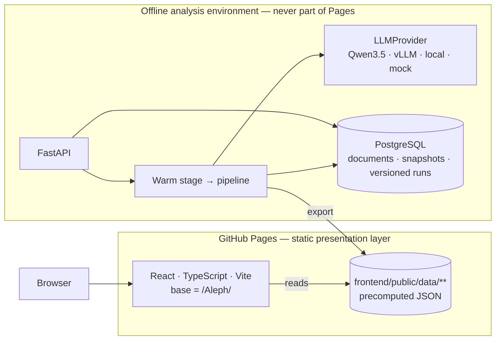

# Aleph — Architecture

Aleph takes **a document, its context, and the public discourse around it**, and produces an
inspectable analysis. It is deliberately *not* built around any particular reform: the first
benchmark is a Chilean bill, but nothing in the library, the schemas, or the frontend knows that.
Jurisdiction-specific facts live only in data and registry files.

---

## 1. The shape of the system



The single most important edge in that diagram is the one from **Readiness** that bypasses
evaluation. If the evidence is thin, Aleph says so and withholds verdicts. It does not substitute
model confidence for missing evidence.

---

## 2. Why the warm stage exists

The naive design asks a language model "is this bill good?" and renders the answer. That product
fails in a specific, predictable way: the model's prior about the topic does the work, and the
document becomes decoration.

The warm stage forces the opposite order. Before any evaluative question is asked, Aleph must
have parsed the document, reduced it to atomic propositions each anchored to a quotable passage,
mapped what it affects, worked out *how the public actually refers to it* (a bill's title is
rarely what the debate calls it), gathered evidence across tiers, and worked out how much of the
apparent coverage is genuinely independent.

Only then is there something to evaluate a claim *against*.

---

## 3. Independence from authority

Aleph separates two things that are constantly conflated:

| | |
|---|---|
| **Source authority** | who produced an artefact, and their standing |
| **Evidential relevance** | what that artefact can actually establish, for *this specific question* |

The distinction is implemented, not just documented. `aleph/evidence/rank.py` carries an explicit
tier-capability matrix — what each kind of source *can* and *cannot* establish — and the ranking
function has no per-institution or per-outlet prestige weight to tune.

So:

- An official bill text is decisive for *"what does the current draft say?"* and carries no weight
  at all for *"will this raise GDP?"*
- A budget office report is decisive for *"what does the budget office estimate?"* and does not
  establish *"this will happen."*
- A statement from an opposition figure and a statement from a minister are evaluated by the same
  rubric, because the evaluator cannot see which is which.

---

## 4. How speaker-blindness is enforced

This is a type-level guarantee rather than a convention, because conventions erode.



`RedactedClaimContext` is a frozen model with `extra='forbid'` and **no field for speaker, party,
coalition, outlet, or government/opposition status**. `evaluate_blind()` accepts that type and
nothing else, so there is no code path by which political identity reaches the factual verdict —
adding one would require changing the type and failing the test suite.

Stage two restores provenance to analyse framing and rhetorical consistency, and takes the
`BlindEvaluation` as *frozen input*. A guard raises if the attributed stage tries to alter the
verdict.

Actor profiles are an additional attributed-stage compartment. `aleph/actors/guard.py` is a
runtime tripwire at the entrance to `evaluate_blind()`: passing an `ActorProfile`, an
`ActorProfileSet`, or any other value instead of `RedactedClaimContext` raises
`NeutralityViolationError` before a check runs. Track records are derived only by grouping verdicts
already stored under `blind_evaluation`; roles and official records never enter that aggregation.

The escape hatch — when the speaker's identity genuinely *is* the fact at issue ("did X say Y?") —
must be requested deliberately and is never the default.

---

## 5. Metrics: nothing opaque, nothing collapsed

Two rules shape every number in the product.

**No single left–right score.** The impact map has seven named axes, each scored −100..+100
against two *named poles*. They describe where a document's identified effects fall. They are not
party labels, and the schema descriptions say so explicitly.

**No score without its components.** Every composite carries a `components[]` array — the
individual contributions, each with a signed weight and evidence references — plus a `confidence`
object. Pydantic validators *raise* if a score is produced with an empty component list. An
uninspectable number is a contract violation, not a cosmetic problem.

The eight framing dimensions carry a `polarity` field (`higher_is_better` / `lower_is_better` /
`neutral`) so a consumer can never mis-colour them — a high `source_diversity` and a high
`loaded_language` are not the same kind of high.

Confidence is likewise split. **Evidence confidence** is derived from coverage, agreement,
corroboration, quantitative validation and retrieval completeness. **Model confidence** is
recorded as a diagnostic and is never the headline figure.

---

## 6. Deployment: an offline producer and a frozen public dossier



GitHub Pages serves static files and nothing else — no Python, scrapers, database, model or
persistent container. The benchmark reads only the precomputed Megarreforma dossier and captured
images. It deliberately has no upload route and no browser-to-API edge. The general FastAPI service
remains an offline/self-hosted producer: a completed, validated run is exported into the static
directory before deployment.

No API key ever reaches the frontend bundle. Everything under `VITE_*` is compiled into public
JavaScript, which is exactly why the model credentials live only in the API's environment.

---

## 7. Model layer

The pipeline codes against an `LLMProvider` abstract base class — `complete(prompt, schema=...)`
plus an optional `embed()`. `QwenProvider` speaks the OpenAI-compatible chat-completions API that
vLLM and most Qwen deployments expose. `MockProvider` is fully deterministic and returns
schema-valid responses, so the entire pipeline, the test suite, and CI run offline with no
credentials.

Swapping the provider must leave the factual evaluation pipeline unchanged. That is the design
constraint the abstraction exists to protect.

The production-local checkpoint is pinned by repository and immutable Hugging Face revision:
`nvidia/Qwen3.5-122B-A10B-NVFP4@98915d837c4e7c87ac8296d02e89de19b3207e6d`. vLLM runs it in
NVFP4 on the single Blackwell GPU and exposes only the OpenAI-compatible protocol to Aleph. The
model container can be placed in Hugging Face offline mode after the first download. The model
tag, revision, pipeline version, prompt version, schema version and configuration fingerprint are
stored with every analysis.

### 7.1 Durable execution

The API is stateless with respect to completed work. SQL tables hold four analysis layers:

1. `documents` stores the submitted input and its stable source fingerprint.
2. `source_snapshots` stores the exact bytes actually analysed, retrieval metadata and SHA-256.
3. `analysis_runs` stores state, all implementation/model versions and the validated result hash.
4. `analysis_artifacts` stores individually hashed phase outputs.

A rerun inserts a new `analysis_runs` row whose `supersedes_run_id` points to the previous run.
Completed rows are never updated. SQLite is supported as a single-process development fallback;
the Compose and production path uses PostgreSQL and Alembic migrations.

Explicit news acquisition has a parallel append-only ledger. `scrape_runs` records each request
and its live counters, `retrieval_snapshots` preserves exact feed and article bytes by URL and
content hash, and `discovered_news` deduplicates canonical article URLs while accumulating their
first and last observation times. Only enabled, verified `news_outlet` entries with a declared
machine-readable feed are eligible. The fetcher still checks the recorded robots policy, applies
the source's per-host delay, and requires `allow_network=True` at the call site.

---

## 8. Repository layout

```
Aleph/
├── aleph/                   # the library — document-agnostic, no jurisdiction logic
│   ├── core/                # ids, enums, pydantic models, config, errors
│   ├── ingestion/           # PDF bytes → text with layout and offsets
│   ├── documents/           # warm 1: DocumentModel, sections, provisions, quantities
│   ├── propositions/        # warm 2-3: atomic propositions, topic graph
│   ├── retrieval/           # warm 4: search vocabulary, search providers
│   ├── news/                # warm 5-6: source registry, clustering, independence
│   ├── evidence/            # evidence store, relevance-based ranking
│   ├── claims/              # extraction, fact/forecast classification, redaction, evaluation
│   ├── framing/             # the eight framing dimensions
│   ├── impact/              # seven policy axes, beneficiary and cost-bearer maps
│   ├── neutrality/          # six perturbations, runner, metrics
│   ├── dossier/             # bounded document brief + comparative-evidence synthesis
│   ├── llm/                 # LLMProvider, QwenProvider, MockProvider
│   ├── export/              # AnalysisBundle assembly, static site export
│   └── pipeline.py          # warm-stage orchestration + readiness gate
├── api/                     # FastAPI service and durable repository
├── migrations/              # append-only store migrations
├── schemas/                 # JSON Schema — the contract between backend and frontend
├── frontend/                # React/TS/Vite static site
│   └── public/data/         # precomputed analyses served by GitHub Pages
├── scripts/                 # validation, refresh, export CLIs
├── tests/                   # offline test suite
├── data/                    # raw / processed / exports working directories
└── .github/workflows/       # ci · pages · refresh
```

---

## 9. Data contract

`schemas/analysis_bundle.json` is the boundary. The backend validates against it before writing;
CI validates every committed dataset against it; the frontend's TypeScript types mirror it field
for field. Changing the shape of the product means changing that schema first.

Ids are stable and human-readable (`doc:`, `prov:`, `clm:`, `ev:`, `art:`, `cluster:`…), and
export is deterministic — sorted keys, stable ordering, unchanged files left untouched — so a
refresh run produces a clean, reviewable diff rather than noise.

The live upload service initially returns a warm-stage `PipelineResult`, not a fabricated full
analysis bundle. Without evidence retrieval its readiness is `insufficient`, `publishable` is
false, evidence and news phases are marked skipped, and no claim verdict is produced. Complete
`AnalysisBundle` objects are the curated/export boundary consumed by static mode.

---

## 10. What the neutrality suite does and does not prove

Before publishing, Aleph re-runs evaluations under six substitutions that *should not matter*:
speaker swap, source swap, party swap, authority removal, claim paraphrase, and evidence-order
shuffle. It tracks verdict flip rate, confidence delta, framing delta and explanation semantic
delta, and aggregates them into a neutrality health figure.

This measures **invariance under irrelevant substitution**. It does not prove political
neutrality, and the schema requires an `interpretation_caveat` string to be carried alongside the
number so the figure is never displayed as if it did.
